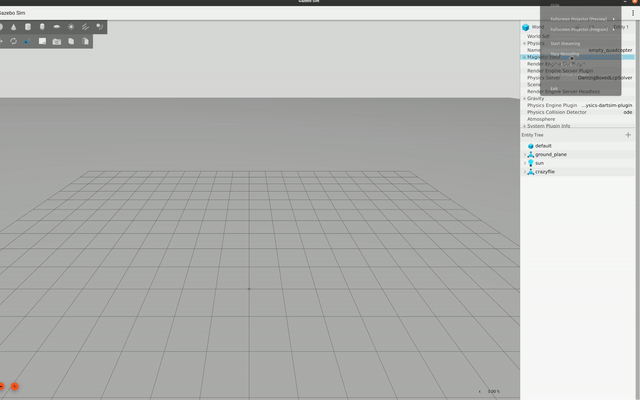
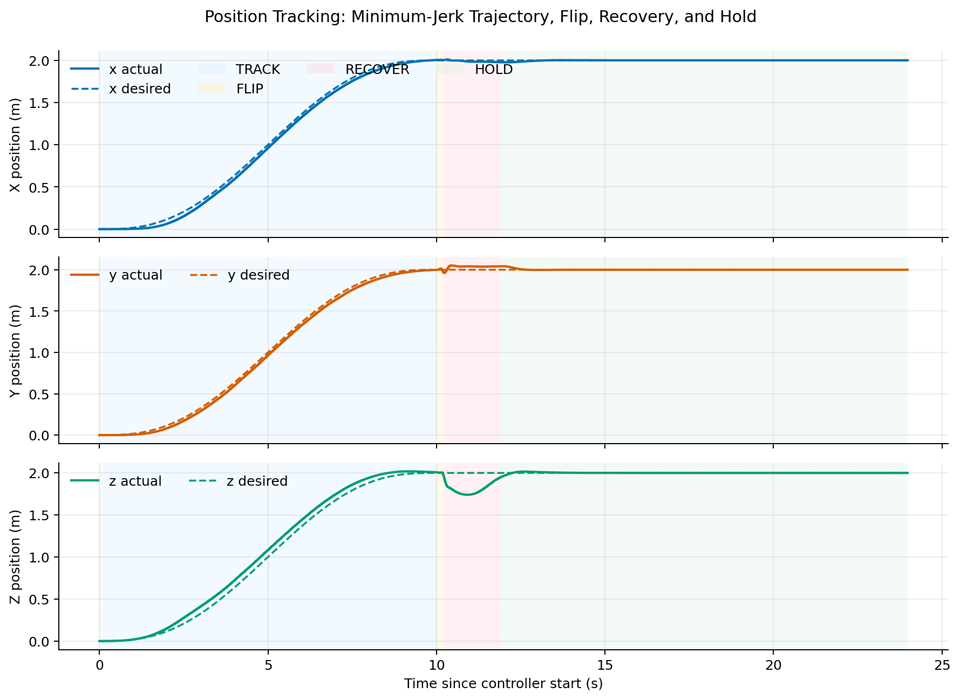
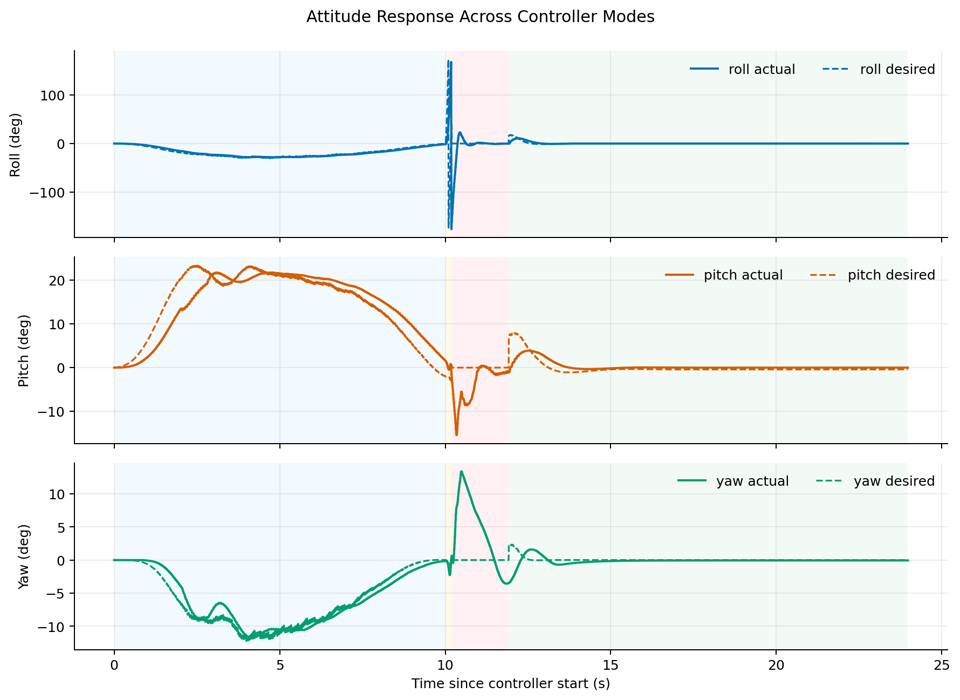
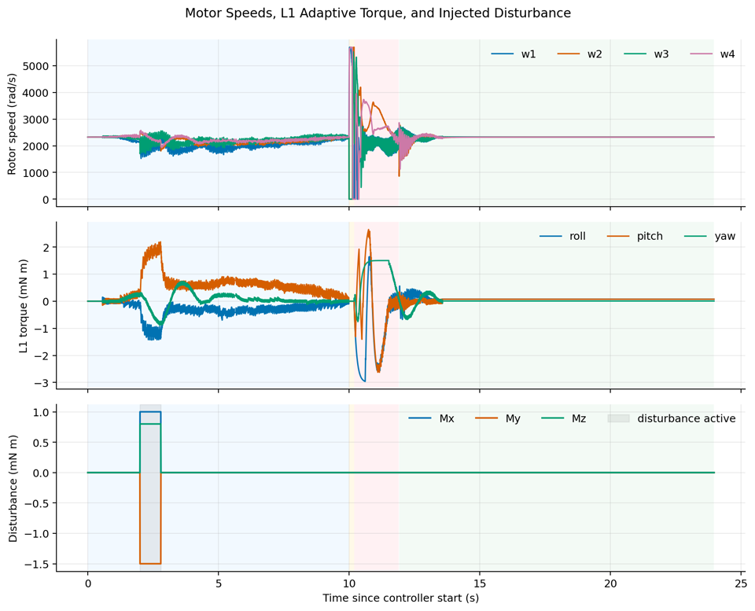

# Crazyflie ROS 2 Simulation

This repository contains a ROS 2 and Gazebo simulation stack for a Crazyflie
micro quadrotor. It includes a Gazebo Harmonic model, ROS-Gazebo bridge
configuration, and controller nodes for commanding the simulated vehicle.

The main workflow is:

1. Launch Gazebo with the Crazyflie model.
2. Bridge odometry, IMU, clock, pose, and motor command topics between Gazebo
   and ROS 2.
3. Run the SE(3) geometric controller with L1 adaptive terms.
4. Inspect the generated flight logs and result plots.

## Demo and Results

### Demo Video

The demo below shows the Crazyflie simulation running the geometric controller
trajectory, flip, recovery, and hold sequence.



### Controller Plots

The plots below were generated from:

```text
so3_controller/logs/flight_log_2025-12-18_10-36-10.csv
```

Position tracking across the minimum-jerk trajectory, flip, recovery, and hold
modes:



Attitude response during the same run:



Motor speeds, L1 adaptive torque, and the injected disturbance window:



The full report is available here:

[Final project report](final_report.pdf)

## Requirements

The project is intended for the following software stack:

- Ubuntu with ROS 2 Humble Hawksbill
- Gazebo Harmonic
- `colcon`
- `xacro`
- `ros_gz_sim` and `ros_gz_bridge`
- `actuator_msgs`
- Eigen3
- Gazebo Harmonic development libraries used by `motor_command_bridge`
  (`gz-transport13` and `gz-msgs10`)

Source ROS 2 before building or running:

```bash
source /opt/ros/humble/setup.bash
```

If dependencies are missing, install the ROS dependencies with `rosdep` from
the workspace root:

```bash
cd ~/crazyflie_ws
rosdep install --from-paths src --ignore-src -r -y
```

You may still need to install Gazebo Harmonic and the ROS-Gazebo packages
separately if they are not already present on the system.

## Repository Layout

This repository is expected to live directly inside a ROS 2 workspace `src`
directory. In the current workspace, the repository root is:

```text
~/crazyflie_ws/src
```

Package overview:

```text
.
|-- crazyflie_description
|   |-- config/ros_gz_crazyflie_bridge.yaml
|   |-- launch/spawn_crazyflie_gz.launch.py
|   |-- launch/view_crazyflie_launch.py
|   |-- meshes/
|   |-- urdf/crazyflie_body.xacro
|   `-- worlds/empty_quadcopter.world
|-- crazyflie_controller
|   |-- launch/position_controller.launch.py
|   `-- src/hover_controller.py
|-- motor_command_bridge
|   `-- src/motor_command_bridge.cpp
|-- media
|   |-- plots
|   |   |-- attitude_response.png
|   |   |-- motor_l1_disturbance.png
|   |   `-- position_tracking.png
|   `-- videos
|       `-- crazyflie_demo.mp4
`-- so3_controller
    |-- logs/
    `-- src/so3_controller.cpp
```

## Packages

### `crazyflie_description`

Defines the simulated Crazyflie model and Gazebo launch flow.

- Builds the Crazyflie URDF from `urdf/crazyflie_body.xacro`.
- Uses the Crazyflie mesh assets from `meshes/collada_files`.
- Starts Gazebo Harmonic with `worlds/empty_quadcopter.world`.
- Spawns the robot as `crazyflie` by default.
- Starts `ros_gz_bridge` with `config/ros_gz_crazyflie_bridge.yaml`.

The model includes:

- Body inertia and mass properties
- Four propeller links
- Multicopter motor plugins
- Odometry publisher plugin
- IMU sensor
- Rotor order:
  - `m1`: front-left, clockwise
  - `m2`: front-right, counter-clockwise
  - `m3`: rear-right, clockwise
  - `m4`: rear-left, counter-clockwise

### `so3_controller`

Contains the main C++ flight controller.

The node is installed as:

```bash
ros2 run so3_controller so3_controller
```

It subscribes to:

- `/crazyflie/odom` (`nav_msgs/msg/Odometry`)
- `/crazyflie/imu` (`sensor_msgs/msg/Imu`)

It publishes:

- `/crazyflie/motor_cmd` (`actuator_msgs/msg/Actuators`)
- `/crazyflie/odom_desired` (`nav_msgs/msg/Odometry`)

The controller sequence is:

1. `TRACK`: follow a minimum-jerk trajectory to `(2, 2, 2)`.
2. `FLIP`: perform a zero-radius roll flip.
3. `RECOVER`: return to an upright attitude and stabilize altitude.
4. `HOLD`: hold the final position.

The controller also logs actual state, desired state, commanded thrust and
moments, disturbance terms, L1 adaptive torques, rotor speeds, and mode flags.

### `crazyflie_controller`

Contains a simple Python PD position controller:

```bash
ros2 launch crazyflie_controller position_controller.launch.py
```

This controller subscribes to `/odom` and publishes `/cmd_vel`. It is useful as
a lightweight reference or starting point, but it is not wired into the current
Gazebo motor-command pipeline by default. To use it with this simulation, remap
topics and add the missing velocity-to-motor-command layer.

### `motor_command_bridge`

Contains an optional C++ bridge for publishing raw Gazebo actuator messages
from a ROS `Float64MultiArray` input.

It subscribes to:

- `/crazyflie/motor_speed` (`std_msgs/msg/Float64MultiArray`)

It publishes directly to the Gazebo topic:

- `/crazyflie/gazebo/command/motor_speed`

The default simulation launch already bridges `/crazyflie/motor_cmd` to this
Gazebo motor topic using `ros_gz_bridge`, so this node is mainly useful for
custom experiments that publish raw motor speeds as a float array.

## Build

Build from the workspace root, not from inside `src`:

```bash
cd ~/crazyflie_ws
source /opt/ros/humble/setup.bash
colcon build --symlink-install
source install/setup.bash
```

If you open a new terminal, source both ROS 2 and the workspace again:

```bash
source /opt/ros/humble/setup.bash
source ~/crazyflie_ws/install/setup.bash
```

## Run the Simulation

Start Gazebo and spawn the Crazyflie:

```bash
cd ~/crazyflie_ws
source /opt/ros/humble/setup.bash
source install/setup.bash
ros2 launch crazyflie_description spawn_crazyflie_gz.launch.py
```

The launch file accepts an optional robot name:

```bash
ros2 launch crazyflie_description spawn_crazyflie_gz.launch.py robot_name:=crazyflie
```

In a second terminal, start the SE(3)+L1 controller:

```bash
cd ~/crazyflie_ws
source /opt/ros/humble/setup.bash
source install/setup.bash
ros2 run so3_controller so3_controller
```

The controller waits until both odometry and IMU messages have been received.
Once those topics are active, it starts the trajectory and publishes rotor
commands.

## Useful Topic Checks

List active topics:

```bash
ros2 topic list
```

Check odometry:

```bash
ros2 topic echo /crazyflie/odom
```

Check IMU data:

```bash
ros2 topic echo /crazyflie/imu
```

Check commanded motor speeds:

```bash
ros2 topic echo /crazyflie/motor_cmd
```

Check the desired trajectory published by the controller:

```bash
ros2 topic echo /crazyflie/odom_desired
```

## Bridged Topics

The default bridge configuration is in:

```text
crazyflie_description/config/ros_gz_crazyflie_bridge.yaml
```

| ROS topic | ROS type | Gazebo topic | Direction |
| --- | --- | --- | --- |
| `/crazyflie/motor_cmd` | `actuator_msgs/msg/Actuators` | `/crazyflie/gazebo/command/motor_speed` | ROS to Gazebo |
| `/clock` | `rosgraph_msgs/msg/Clock` | `/world/empty_quadcopter/clock` | Gazebo to ROS |
| `/crazyflie/odom` | `nav_msgs/msg/Odometry` | `/crazyflie/odom` | Gazebo to ROS |
| `/crazyflie/pose` | `geometry_msgs/msg/PoseArray` | `/model/crazyflie/pose` | Gazebo to ROS |
| `/crazyflie/imu` | `sensor_msgs/msg/Imu` | `/crazyflie/imu` | Gazebo to ROS |

## Flight Logs

The SE(3) controller writes CSV logs to:

```text
~/crazyflie_ws/src/so3_controller/logs/
```

Files are named with the launch time:

```text
flight_log_YYYY-MM-DD_HH-MM-SS.csv
```

Each row includes:

- Time
- Actual and desired position
- Actual and desired velocity
- Actual and desired roll, pitch, and yaw
- Actual and desired body rates
- Total thrust
- Commanded moments
- Injected disturbance moments
- L1 adaptive torque terms
- Rotor speeds
- Controller mode
- Disturbance active flag

Mode values are:

| Mode value | Controller mode |
| --- | --- |
| `0` | `TRACK` |
| `1` | `FLIP` |
| `2` | `RECOVER` |
| `3` | `HOLD` |

## Troubleshooting

### `spawn_crazyflie_gz.launch.py` cannot find `ros_gz_sim`

Install the ROS-Gazebo integration packages for your ROS 2 and Gazebo
distribution, then rebuild and source the workspace.

### Gazebo opens but the Crazyflie does not move

Check that `/crazyflie/odom`, `/crazyflie/imu`, and `/crazyflie/motor_cmd` are
active. The main controller does not start until it has received both odometry
and IMU messages.

### Build fails on `gz-transport13` or `gz-msgs10`

Install the Gazebo Harmonic development packages. These are required by the
optional `motor_command_bridge` package.

### Meshes or URDF assets are missing

Rebuild from the workspace root and source `install/setup.bash`. The description
package installs launch files, URDF files, meshes, RViz config, bridge config,
and worlds into the workspace install space.

### The Python position controller does not affect the Gazebo model

The Python controller publishes `/cmd_vel`, while the Gazebo model expects motor
speed commands. Use the SE(3) controller for the default simulation path, or add
a node that converts velocity commands into motor commands.
